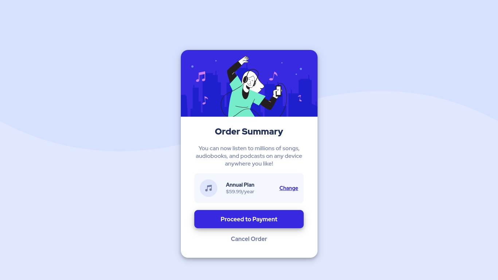

# Frontend Mentor - Order summary card solution

This is a solution to the [Order summary card challenge on Frontend Mentor](https://www.frontendmentor.io/challenges/order-summary-component-QlPmajDUj). Frontend Mentor challenges help you improve your coding skills by building realistic projects.

## Table of contents

- [Overview](#overview)
  - [The challenge](#the-challenge)
  - [Screenshot](#screenshot)
  - [Links](#links)
- [My process](#my-process)
  - [Built with](#built-with)
  - [What I learned](#what-i-learned)
  - [Continued development](#continued-development)
  - [Useful resources](#useful-resources)
- [Author](#author)

## Overview

### The challenge

Users should be able to:

- See hover states for interactive elements

### Screenshot

### Links

- Solution URL: [github](https://github.com/chazm78/order-summary-card)
- Live Site URL: [vercel](http://order-summary-card-eta.vercel.app/)

### Built with

- Semantic HTML5 markup
- CSS custom properties
- Flexbox

### What I learned

I have tinkered a bit over the years with CSS. This is my first real attempt at coding anything. So everything I have done on this challenge has been a learning adventure. I have a pretty dialed in schedule set aside to learning Frontend. I have been bouncing between the app called Mimo and the obvious freecodecamp.  

### Continued development

There is more than one way to build something. I know my code is messy or at least that's how I feel. The more I practice building things the better I get. I'd like to get better at laying things out in a more structured way.

### Useful resources

The Internet

## Author

- Frontend Mentor - [@chazm78](https://www.frontendmentor.io/profile/chazm78)
- Github - [@chazm78](https://github.com/chazm78)
